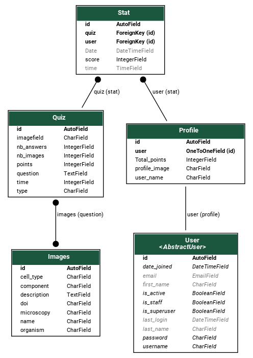

# Django_DLAD

##Description
heroku link

##requirements 

## Populate db
The process of populating database tables must respect the cardinalities between each table thus populating the \
database can be performed in this order :

1. filling images table 
> python manage.py import_images_csv leran/data/images.csv
2. filling questions table
> python manage.py import_question_csv leran/data/question.csv
3. filling answers table 
> python manage.py import_answers_csv leran/data/answers.csv

the scripts used for these tasks are located in <code> learn/management/commands/ </code>

## UML Diagram
### Generate UML
    python manage.py graph_models   -a -I profile,stats,User,Images,Question,Answers_list -o foo_bar.png

## Project organisation
applications 
